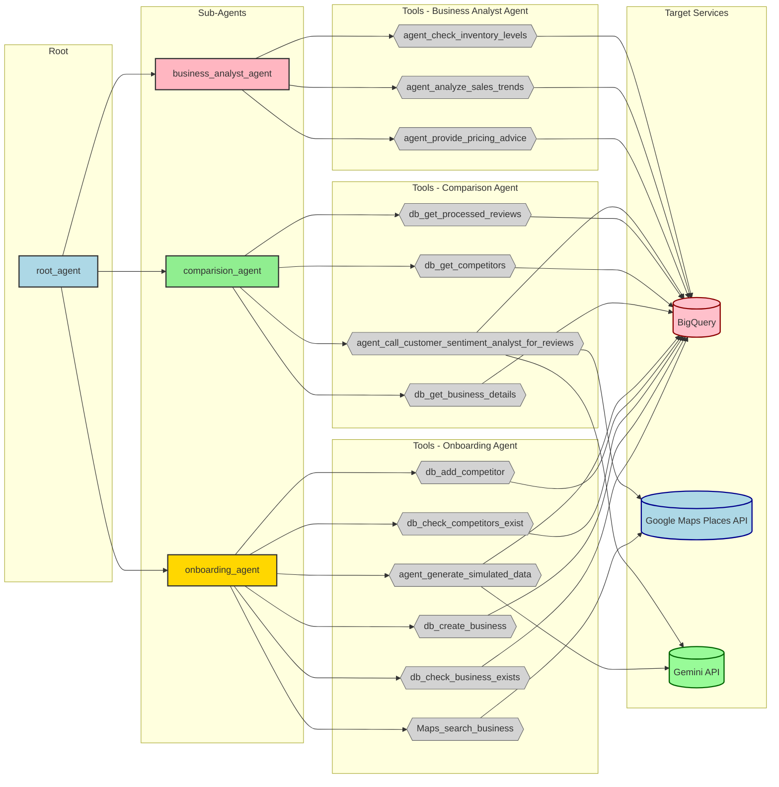

# ProfitPilot AI Business Optimization Assistant

**ProfitPilot AI** is an intelligent, multi-agent assistant that empowers small and medium-sized businesses with data-driven insights and actionable recommendations. By leveraging cutting-edge AI and cloud data solutions, ProfitPilot helps owners optimize profitability, manage inventory, and understand market dynamics.

---
## Architecture Diagram




---

## Key Features

ProfitPilot's specialized AI agents collaborate to provide comprehensive business intelligence:

### Intelligent Onboarding & Data Seeding
- Streamlines initial setup, capturing essential business details.
- Can generate realistic sample sales and inventory data using Gemini for quick demonstrations or new businesses, directly populating BigQuery.

### Dynamic Business Analytics (Powered by Gemini)
- **Sales Trend Analysis**: Analyzes BigQuery sales data with Gemini 1.5 Flash to identify growth, peak periods, popular items, and anomalies.
- **Inventory Level Monitoring**: Reports on current stock, highlighting low-stock or perishable items.
- **Pricing Advice**: Uses Gemini 1.5 Flash to analyze costs, sales prices, and profitability, providing strategic pricing recommendations.

### Competitive Intelligence (Google Maps & Gemini)
- Performs external calls to Google Maps Places API to discover nearby competitors and fetch their public reviews.
- Gemini 1.5 Flash then analyzes this external data for competitive comparisons and market insights.

### Centralized Orchestration
- A Root Agent interprets user queries, manages context, and intelligently delegates tasks across the system, synthesizing agent responses into clear, user-friendly insights.

---

## Technologies

ProfitPilot is built on a robust Google Cloud ecosystem:

- **Google Gemini 1.5 Flash API**: Powers all AI-driven understanding, analysis, insight generation, and natural language responses.
- **Google BigQuery**: Scalable, serverless data warehouse for all core business data (sales, inventory, business profiles).
- **Google Maps Platform / Places API**: Used for competitor discovery and fetching public review data.
- **Python**: Core development language.
- **Python Libraries**: `google-cloud-bigquery`, `google-generativeai`, `googlemaps`, `Flask` (for web deployment).
- **Other Data Sources**: Integrates with Google My Business (GMB) for initial business profile data.

---

## Key Learnings

Developing ProfitPilot highlighted several critical insights:

- **Agentic Architectures**: Breaking down complex problems into specialized AI agents significantly enhances maintainability and performance.
- **LLM & Structured Data**: Effectively transforming structured data (e.g., BigQuery results as JSON) for Gemini's analysis is crucial for deriving precise insights.
- **External API Integration**: Seamlessly integrating external services like Google Maps for real-time competitive data proved essential.
- **Context Management**: Maintaining conversational context and `business_id` across agents is key to a fluid user experience.

---

## Deployment Steps

```bash
export GOOGLE_API_KEY=
export GOOGLE_MAP_API_KEY=
export GOOGLE_CLOUD_PROJECT=
export BQ_DATASET_ID=
export GOOGLE_GENAI_USE_VERTEXAI=FALSE
export GOOGLE_CLOUD_LOCATION=
export AGENT_PATH="./PIAgent"
export APP_NAME="profitpilot-agent-app"
export SERVICE_NAME="profitpilot-agent-service"

adk deploy cloud_run \
  --project=$GOOGLE_CLOUD_PROJECT \
  --region=$GOOGLE_CLOUD_LOCATION \
  --service_name=$SERVICE_NAME \
  --app_name=$APP_NAME \
  --with_ui $AGENT_PATH
```