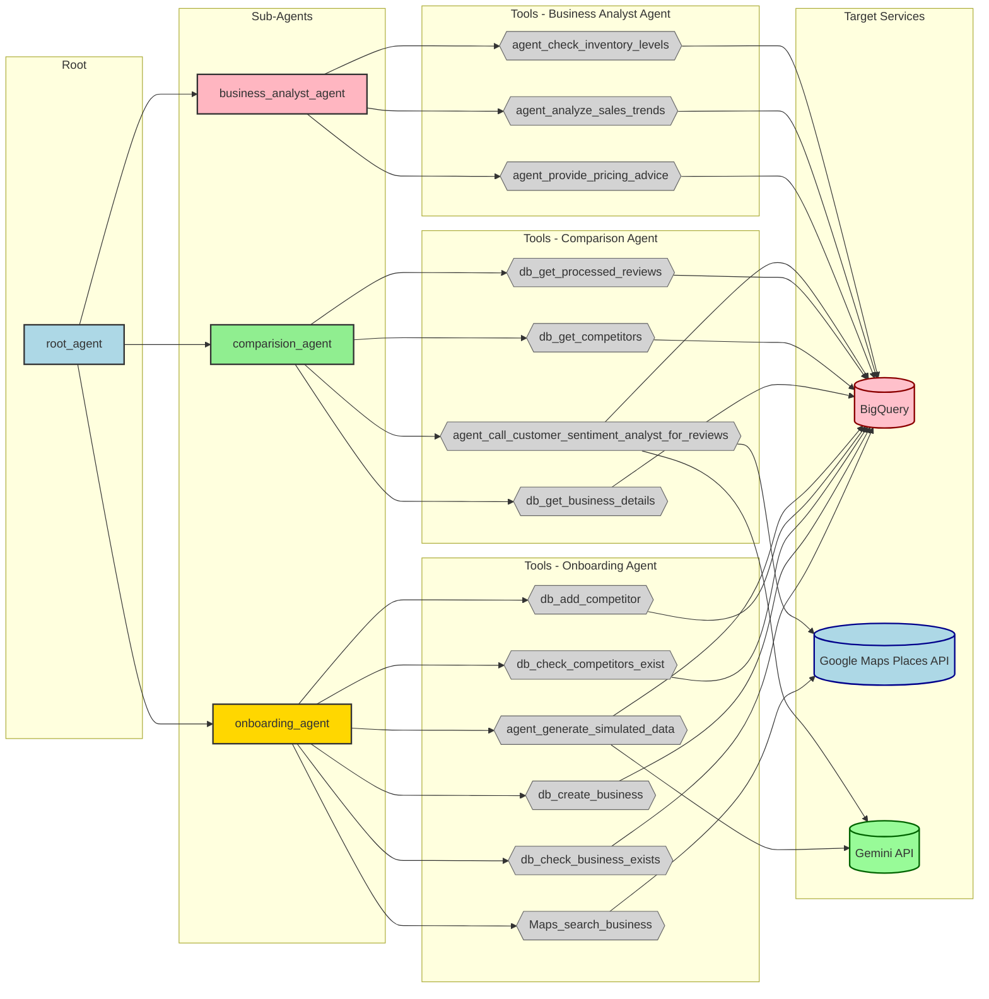

# ProfitPilot AI Business Optimization Assistant

**ProfitPilot AI** is an intelligent, multi-agent assistant that empowers small and medium-sized businesses with data-driven insights and actionable recommendations. By leveraging cutting-edge AI and cloud data solutions, ProfitPilot helps owners optimize profitability, manage inventory, and understand market dynamics.

---
## Architecture Diagram




---

## Key Features

ProfitPilot's specialized AI agents collaborate to provide comprehensive business intelligence:

### Intelligent Onboarding & Data Seeding
- Streamlines initial setup, capturing essential business details.
- Can generate realistic sample sales and inventory data using Gemini for quick demonstrations or new businesses, directly populating BigQuery.

### Dynamic Business Analytics (Powered by Gemini)
- **Sales Trend Analysis**: Analyzes BigQuery sales data with Gemini 1.5 Flash to identify growth, peak periods, popular items, and anomalies.
- **Inventory Level Monitoring**: Reports on current stock, highlighting low-stock or perishable items.
- **Pricing Advice**: Uses Gemini 1.5 Flash to analyze costs, sales prices, and profitability, providing strategic pricing recommendations.

### Competitive Intelligence (Google Maps & Gemini)
- Performs external calls to Google Maps Places API to discover nearby competitors and fetch their public reviews.
- Gemini 1.5 Flash then analyzes this external data for competitive comparisons and market insights.

### Centralized Orchestration
- A Root Agent interprets user queries, manages context, and intelligently delegates tasks across the system, synthesizing agent responses into clear, user-friendly insights.

---

## Technologies

ProfitPilot is built on a robust Google Cloud ecosystem:

- **Google Gemini 1.5 Flash API**: Powers all AI-driven understanding, analysis, insight generation, and natural language responses.
- **Google BigQuery**: Scalable, serverless data warehouse for all core business data (sales, inventory, business profiles).
- **Google Maps Platform / Places API**: Used for competitor discovery and fetching public review data.
- **Python**: Core development language.
- **Python Libraries**: `google-cloud-bigquery`, `google-generativeai`, `googlemaps`, `Flask` (for web deployment).
- **Other Data Sources**: Integrates with Google My Business (GMB) for initial business profile data.

---

## Key Learnings

Developing ProfitPilot highlighted several critical insights:

- **Agentic Architectures**: Breaking down complex problems into specialized AI agents significantly enhances maintainability and performance.
- **LLM & Structured Data**: Effectively transforming structured data (e.g., BigQuery results as JSON) for Gemini's analysis is crucial for deriving precise insights.
- **External API Integration**: Seamlessly integrating external services like Google Maps for real-time competitive data proved essential.
- **Context Management**: Maintaining conversational context and `business_id` across agents is key to a fluid user experience.

---

## Deployment Steps

```bash
export GOOGLE_API_KEY=
export GOOGLE_MAP_API_KEY=
export GOOGLE_CLOUD_PROJECT=
export BQ_DATASET_ID=
export GOOGLE_GENAI_USE_VERTEXAI=FALSE
export GOOGLE_CLOUD_LOCATION=
export AGENT_PATH="./PIAgent"
export APP_NAME="profitpilot-agent-app"
export SERVICE_NAME="profitpilot-agent-service"

adk deploy cloud_run \
  --project=$GOOGLE_CLOUD_PROJECT \
  --region=$GOOGLE_CLOUD_LOCATION \
  --service_name=$SERVICE_NAME \
  --app_name=$APP_NAME \
  --with_ui $AGENT_PATH
```

## Sample Agent Conversion

### Initial Setup

* **User:** Hi, Welcome to ProfitPilot AI! To get started, could you please tell me your business name and address?
* **User Input:** Shipley Do-Nuts, Fulshear, TX 77494
* **ProfitPilot AI:** Welcome to ProfitPilot AI! I see you're ready to set up your business. I'm now handing you over to our Onboarding Agent. They will guide you through the rest of the setup process, including verifying your business and adding competitors. Please provide any additional details they ask for.

### Onboarding Agent Takes Over

* **Onboarding Agent:** Okay, I'm the Onboarding Agent and I'll help you complete the setup. I have your business name as Shipley Do-Nuts and the address as Fulshear, TX 77494.
* **Onboarding Agent:** I didn't find that business in our system. Would you like me to search Google Maps for it?
* **User Input:** Yes
* **Onboarding Agent:** I found a business at that address on Google Maps: Shipley Do-Nuts. Is this your business?
* **User Input:** yes

### Business Profile Creation

* **Onboarding Agent:** Great! Since this is a new business, I'll need a few more details to create a profile. Could you please provide the business type (e.g., restaurant, retail), a brief description of the business, your Google My Business ID (if you have one), and your owner contact information?
* **User Input:** description is Donut Shop and you can skip owner info
* **Onboarding Agent:** Okay, I have the business name as Shipley Do-Nuts, address as Fulshear, TX 77494, and the description as Donut Shop. What is the business type? Also, do you have a Google My Business ID?
* **User Input:** Get the GMB ID from Google Map Search
* **Onboarding Agent:** Okay, I got the Google Place ID "ChIJE7Ar-mwjQYYRifD8cBm-tUQ" from Google Maps. I will use this as the GMB ID. What is the business type for Shipley Do-Nuts?
* **User Input:** Retail
* **Onboarding Agent:** Okay, I have the following details: Name: Shipley Do-Nuts, Address: Fulshear, TX 77494, Business Type: Retail, Description: Donut Shop, GMB ID: ChIJE7Ar-mwjQYYRifD8cBm-tUQ. Is this all correct and ready to create the business profile?
* **User Input:** yes
* **Onboarding Agent:** Great! The business profile has been created with the business ID `biz_e01aa349`.

### Adding Competitors

* **Onboarding Agent:** Now, let's add some competitors. Are there any key competitors you'd like to add for Shipley Do-Nuts?
* **User Input:** Southern Maid Donuts - Search for correct address on maps
* **Onboarding Agent:** Okay, I found multiple locations for Southern Maid Donuts. Could you please provide the correct address or Google Place ID for the location that competes with Shipley Do-Nuts in Fulshear, TX?
* **User Input:** give me list to pick from
* **Onboarding Agent:** I found several Southern Maid Donuts locations. Here are some of the closest ones to Fulshear, TX:
    1.  907 Eldridge Rd, Sugar Land, TX 77478, United States
    2.  18721 University Blvd #200, Sugar Land, TX 77479, United States
    3.  12414 S Kirkwood Rd, Stafford, TX 77477, United States
    4.  6449 Richmond Ave., Houston, TX 77057, United States
    5.  11041 Huffmeister Rd, Houston, TX 77065, United States
    Please tell me the number corresponding to the correct location, or say "none of these" if none are relevant.
* **User Input:** ok select third option i.e. 12414 S Kirkwood
* **Onboarding Agent:** Okay, so you're selecting the Southern Maid Donuts located at 12414 S Kirkwood Rd, Stafford, TX 77477. The Place ID for this location is ChIJKUyjUsfnQIYRjCZkzg8Upvw.
* **Onboarding Agent:** Okay, I've added Southern Maid Donuts as a competitor.

### Generating Simulated Data

* **Onboarding Agent:** Now that your business is fully set up, would you like me to generate some simulated sales and inventory data for Shipley Do-Nuts? This is a great way to immediately explore ProfitPilot's sales analysis and inventory management features, especially helpful for our hackathon demo!
* **User Input:** Yes generate
* **Onboarding Agent:** Fantastic! I'm generating your simulated sales and inventory data now. This might take a moment, but it'll make exploring the platform much more dynamic.
* **Onboarding Agent:** Okay, the simulated data has been generated for Shipley Do-Nuts. Your business is now fully set up with competitors and simulated data! You can now ask ProfitPilot AI for insights on sales trends, inventory management, and competitor analysis. I'm handing you back to the main ProfitPilot AI now.

## Business Analysis by ProfitPilot AI

### Comparative Edge Analysis (Reviews)

* **User:** compare reviews and provide suggestion on improvement
* **Comparative Edge Analyst:** Okay, I'm the Comparative Edge Analyst. I'm starting the process to compare your business reviews with your competitors.
* **Comparative Edge Analyst:** I'm collecting and processing the latest reviews for your business and its competitors. This may take a few moments. I'll present the analysis once the data is ready.
* **User:** any update?
* **Comparative Edge Analyst:** Okay, I now have processed reviews for both Shipley Do-Nuts and Southern Maid Donuts. Here's a comparative analysis:
```
    **Overall Sentiment Summary:**

    * **Shipley Do-Nuts:** Average rating of 4.6 (based on 5 reviews). All reviews have a neutral sentiment score, which suggests the sentiment analysis may need further refinement.
    * **Southern Maid Donuts:** Average rating of 5.0 (based on 5 reviews). Similar to Shipley, all reviews have a neutral sentiment score.

    **Key Themes and Entity Analysis:**

    * **Shipley Do-Nuts:**
        * **Positive Themes:** Freshness and Consistency. Customers repeatedly highlight the freshness of the donuts, especially the glazed ones, and the consistent quality across different times of the day. Apple fritters are a favorite. Accessible drive-through and clean interior.
        * **Negative Themes:** Inattentive staff and potential for order errors.
    * **Southern Maid Donuts:**
        * **Positive Themes:** Fast and friendly service, good kolaches and coffee. Known for huge breakfast sandwiches with homestyle taste. Fresh and delicious donuts, better than nearby shops. Passionate owner.
        * **Negative Themes:** Wish coffee was better at this location (mentioned by one reviewer).

    **Strengths Identified:**

    * **Shipley Do-Nuts:** Consistent quality, fresh glazed donuts, accessible drive-through, clean interior.
    * **Southern Maid Donuts:** Fast and friendly service, variety of items (kolaches, breakfast sandwiches), fresh donuts, passionate owner.

    **Weaknesses Identified:**

    * **Shipley Do-Nuts:** Customer service attentiveness, potential order errors.
    * **Southern Maid Donuts:** Coffee quality (according to one review).

    **Opportunities for Shipley Do-Nuts:**

    * **Enhance Customer Service Training:** Address the complaints about inattentive staff. Implement training programs focused on customer engagement and order accuracy.
    * **Promote Consistency:** Continue emphasizing the consistent quality that customers appreciate. Highlight this in marketing materials.
    * **Consider a Loyalty Program:** Given the emphasis on repeat visits and consistency, a loyalty program could further incentivize frequent customers.
    * **Expand on Positive Mentions:** The positive mention of the apple fritters should be used in promotions and possibly expanded upon with new fritter flavors.
    * **Competitive Advantage:** Southern Maid Donuts seems to have a wider variety of offerings (kolaches, breakfast sandwiches). Shipley could consider expanding their menu to compete more directly.
    * **Address the Coffee Offering:** While not explicitly negative in the Shipley reviews, Southern Maid received a minor critique about their coffee. This is an opportunity for Shipley to ensure their coffee is consistently high quality, potentially highlighting it as a strength.

    **Overall Competitive Comparison Summary:**
    Both Shipley Do-Nuts and Southern Maid Donuts receive generally positive reviews. Shipley's strength lies in its consistency and specific items like glazed donuts and apple fritters. Southern Maid appears to excel in variety and service. Shipley can improve by focusing on customer service and potentially expanding its menu to better compete with Southern Maid's broader offerings.
```
### Inventory Insights

* **User:** Thanks, can you provide some insights on my inventory
* **ProfitPilot AI:** I am designed to compare customer reviews between businesses. For insights on inventory, I can transfer you to business_analyst_agent who is better suited to answer your question.
* **Business Analyst Agent:** Okay, I can help with that. To give you the most relevant inventory insights, would you like to see all inventory levels or just items that are low in stock? I have your business id as `biz_e01aa349`.
* **User Input:** all
* **Business Analyst Agent:** Here is your inventory stock level report:
```
    **Overview:** All items have a current stock level exceeding their respective reorder thresholds.

    **Perishable Items:** All perishable items have sufficient stock levels above their reorder thresholds. However, given their short shelf life (2 days for most donuts), close monitoring of stock rotation is crucial to minimize waste.

    **Recommendation:** Regular stock takes should be performed, and consideration should be given to implementing a just-in-time inventory system for highly perishable items to minimize waste.
```
### Sales Trends Analysis

* **User:** any sales trends
* **Business Analyst Agent:** Okay, I can help you analyze your sales trends. Would you like to analyze sales for a specific time period, or should I use the default of the last 30 days?
* **User Input:** yes last 30 days is fine
* **Business Analyst Agent:** Here's the sales trend analysis for the last 30 days, based on the available simulated data:
```
    **Important Note:** The analysis is based on a very limited dataset (a few minutes on a single day, June 1st, 2025), and as such, the insights are not reliable. A longer timeframe is needed for robust trend identification.

    **Highlights (with the caveat above in mind):**

    * **Most Popular Item by Quantity:** Glazed Donuts (9 sold)
    * **Most Popular Item by Revenue:** Glazed Donuts (due to higher sales quantity)

    **Conclusion:**
    To perform a meaningful sales analysis, a significantly larger dataset covering at least a month, ideally including daily sales totals across a much longer period, is required. The current data only provides a snapshot of sales activity over a very short period and only on a single day.
```
### Pricing Advice

* **User:** any pricing advice
* **Business Analyst Agent:** Here's some pricing advice based on the available data:
```
    **Overall Observations:**

    * Low sales volume for most items.
    * Profitability varies widely across items.

    **Item-Specific Recommendations:**

    * **Glazed Donut:** Maintain current price ($1.25) and focus on increasing sales volume.
    * **Boston Cream Donut:** Consider a slight price increase (e.g., to $2.25) to test the market's responsiveness.
    * **Jelly Filled Donut:** Consider a price reduction to attract more customers (e.g., $1.50) or focus on cost reduction.
    * **Coffee:** Evaluate a small price decrease to stimulate demand or investigate the reasons for low coffee sales.
    * **Orange Juice, Donut Holes, Chocolate Donut:** Investigate potential reasons for low sales. Consider price optimization, bundling, cost reduction, or marketing and promotion.

    **General Recommendations:**

    * Expand data collection to include more sales data for each item.
    * Conduct a comprehensive competitor analysis.
    * Implement a dynamic pricing strategy, adjusting prices based on demand.

    **Important Note:** The recommendations are based on limited sales data. Further analysis and market research are essential for making informed and effective pricing decisions. A/B testing different price points for each item should be undertaken to measure the impact on sales and profit.
```